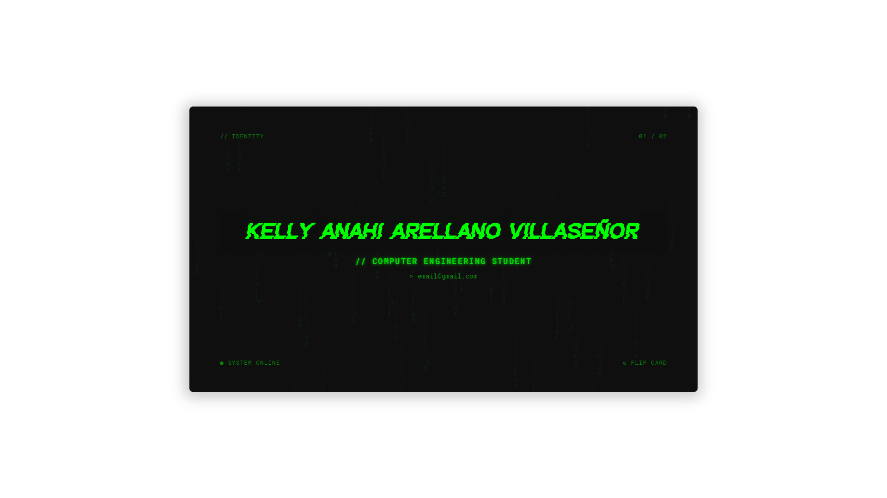
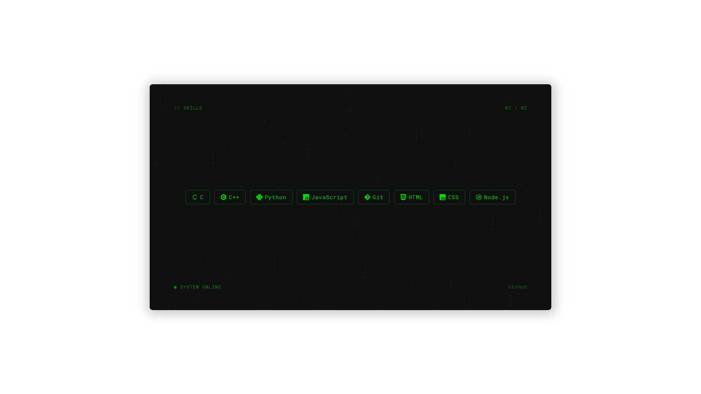

# Matrix Interactive Business Card
A 3D interactive digital portfolio card built with React. It features a Matrix-style digital rain effect, neon glow styling, and physics-based interactions to showcase your perfil.

## ˗ˏˋ ★ [**Click here to view**](https://virtual-card-six-livid.vercel.app/) ★ ˎˊ˗ 

### What does it do?
- Displays a Matrix-style digital rain animation that decodes into the main text on load.
- Features a subtle 3D "tilt" effect that tracks mouse movement to simulate physical depth.
- Allows the user to flip the card (3D flip) by dragging horizontally to reveal the back face.
- Shows a clean grid layout on the back displaying technical proficiencies.

### Technical Concepts Used:
- 3D manipulation and animations within a React environment.
- State management for handling the tilt and flip interactions smoothly.
- CSS styling for neon glow effects, contrast, and layout composition.
- Component structuring for the front and back card faces.

### Preview

(*ᴗ͈ˬᴗ͈)ꕤ*.ﾟ [**Link**](https://virtual-card-six-livid.vercel.app/)

---

## Technologies

- React
- JavaScript
- CSS3
- HTML5

## ₊˚⊹♡ Author

[Kasinfire](https://github.com/Kasinfire)